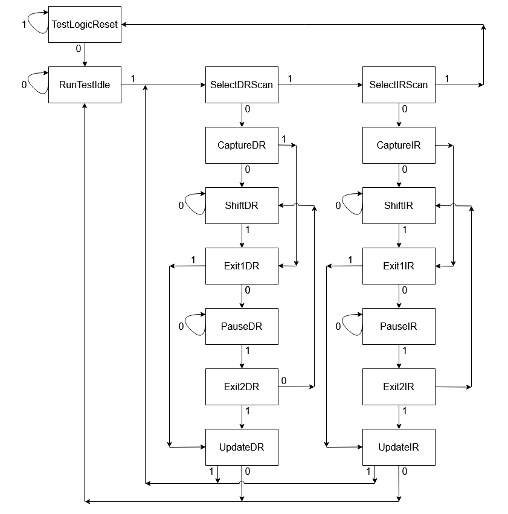
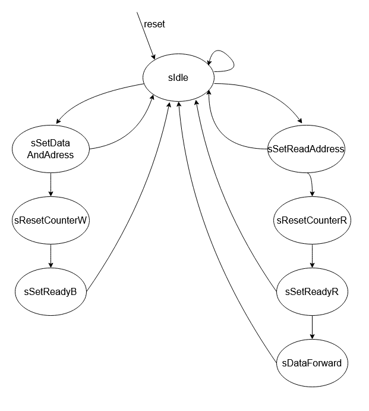

JTAG To Memory Master (JTAG2MM) Chisel Generator
========================================================

## Overview
This repository contains a generator of JTAG to Memory Master modules, written in [Chisel](http://www.chisel-lang.org) hardware design language. Generated modules can initiate AXI4/TileLink(TL) transactions and drive AXI4/TL 
memory mapped slave through an interconnect bus.

To make a Chisel project and include JTAG2MM generator, an open source starter template [Chipyard Framework](http://github.com/ucb-bar/chipyard) can be used.

### JTAG To Memory Master
JTAG To Memory Master block can be divided into two subparts: JTAG controller and AXI4/TL controller. Its simplified block diagram with input and output interfaces is shown below.

### JTAG Controller

The main task of the JTAG controller is to collect signals from JTAG input serial interface and forward them to AXI4/TL controller in correct form through parallel port, as well as to acquired signals from parallel port convert to serial 
data and output them using JTAG output serial interface. JTAG serial interface consists of standard JTAG signals:
- `TCK` - test clock input signal, used as clock signal for JTAG controller
- `TMS` - test mode select input signal, used for state transition inside JTAG FSM
- `TDI` - test data in input signal, used to acquire data sent to the module
- `TDO_data` - test data out output data signal, used to send data to the output
- `TDO_driven` - test data out output valid signal, used to indicate that data on the output is valid
- `asyncReset` - asynchronous reset signal, used for entering reset state inside JTAG FSM

JTAG finite state machine (FSM) is a standard JTAG FSM and it is used to ensure that the JTAG controller is working properly. Through the change of states of this FSM, it is possible to acquire instruction and data values from the JTAG serial input interface. 
`TCK` signal is used as a clock signal, state changing happens thanks to `TSM` signal and `TDI` signal is stored as data. JTAG FSM state changing diagram is shown below.

JTAG controller is decsribed inside the `src/main/scala/jtagToMaster.scala` scala file. JTAG FSM, JTAG IO bundles and some of the other subparts and submodules are acquired and edited from the existing gihub repository: 
[chisel-jtag](https://github.com/ucb-art/chisel-jtag) .

### AXI4/TL Controller
 
AXI4/TL controller is used to initiate transactions and drive signals through an interconnect bus. Unlike the JTAG controller, it is driven by system clock signal. It receives instruction and data values from JTAG 
controller and acts correspondingly. It also has a FSM which ensures that write and read transactions are performed in accordance with appropriate transfer protocol. FSM is represented in the figure below. 
FSM for AXI4 controller consists of eight states:
- `sIdle` - reset state, stays in this state until write or read transaction is initiated
- `sSetDataAndAddress` - state in which address is set on AW channel, data is set on W channel and valid signals are set on both AW and W channels. Stays in this state until ready signals are not valid on both W and AW channels 
or until a counter that ensures that FSM isn't stuck in this state counts out
- `sResetCounterW` - state in which the mentioned counter is reset. Stays in this state for exactly one clock cycle 
- `sSetReadyB` - state in which ready signal is set on acknowledgement B channel. Stays in this state until B channel valid signal is not active or until a counter that ensures that FSM isn't stuck in this state counts out
- `sSetReadAddress` - state in which address and valid signals are set on AR channel. Stays in this state until AR channel ready signal is not valid or until a counter that ensures that FSM isn't stuck in this state counts out
- `sResetCounterR` - state in which the mentioned counter is reset. Stays in this state for exactly one clock cycle 
- `sSetReadyR` - state in which ready signal is set on R channel and data is read from the same channel. Stays in this state until R channel valid signal is not active or until a counter that ensures that FSM isn't 
stuck in this state counts out
- `sDataForward` - state in which read data is forwarded to the JTAG controller, along with active validIn signal. Stays in this state until receivedIn signal is not active

TileLink FSM has different protocol signals involved, but works on the same principles as AXI4 FSM. AXI4 and TL controllers, as well as the appropriate FSM, are decsribed inside the `src/main/scala/jtagToMaster.scala` scala file.

### User manual

Total of four instructions are necessary for the JTAG2MM module to work properly and that's exactly how many instructions are defined. Instruction codes along with its descriptions are provided below:
- `0x01` - write instruction, initiates the AXI4/TL FSM to begin writing acquired data to acquired address
- `0x02` - address acquire instruction, accepts the serial data as the address for read/write instruction
- `0x03` - data acquire instruction, accepts the serial data as the data for read/write instruction
- `0x04` - read instruction, initiates the AXI4/TL FSM to begin reading data from the acquired address

User initiates one of defined instruction by driving the input JTAG signals with appropriate values. `TCK` signal should be driven continuously. Using `TMS` signal, JTAG FSM enters the state in which it accepts the serial data 
from `TDI` input as the instruction value. Address and data acquire instructions require data values besides address values, so after sending appropriate instruction code, by using `TMS` signal, user should enter the 
JTAG FSM state in which it accepts the serial data from `TDI` input as the data value. In these instructions, provided data is stored into appropriate registers, so that the write or read instruction can be performed. 
Before the write instruction, both address acquire and data acquire instructions must be performed. Before the read instruction, address acquire instruction must be performed. Current instruction and data values are 
being continuously sent from JTAG controller to AXI4/TL controller. When instruction value equals address acquire or data acquire instruction code, obtained data value is stored in either data or address register inside 
the AXI4/TL controller. When instruction value equals read or write instruction code, that's the indicator for the AXI4/TL controller to start read/write transaction on the interconnect bus. Two read instructions or two write 
instructions cannot appear sequentially one right after another, there must be at least one other instruction between these two. After performing the read instruction, read data appear on the serial output JTAG `TDO` port.

## Tests

Several tests were used to verify the correctness of the module. They are defined inside the `src/test` directory. Three scala files and one python file exist:
- `scala/jtagToMasterTester.scala` - test file that includes basic test to checkout the interconnect bus signals for both AXI4 and TL protocols.
- `scala/jtag2Axi4NCOTester.scala` - test used to verify the AXI4 variant of the module working with another module with memory mapped control registers connected to the AXI4 bus. [NCO](https://github.com/milovanovic/nco) 
module is used.
- `scala/jtag2TLPassthroughTester.scala` - test used to verify the TL variant of the module working with another module with memory mapped control registers connected to the TL bus. A custom passthrough module is used.
- `python/gpio_for_jtag.py` - test used for FPGA hardware verification of the AXI4 variant of the module working with another module with memory mapped control registers connected to the AXI4 bus.

All these test can be run using `testOnly jtag2mm.TestNameSpec` command.
